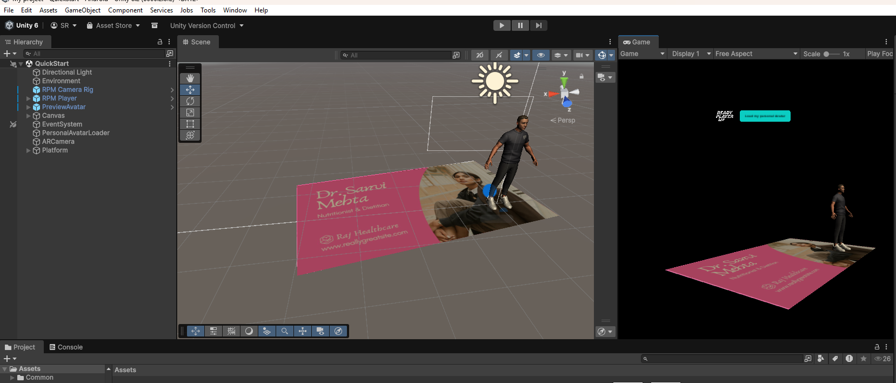
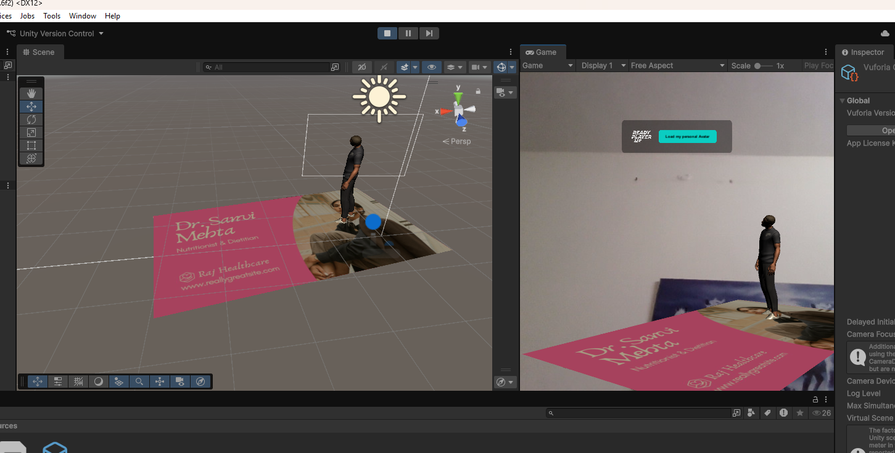

# AR Business Card (Interactive Portfolio) 📇✨

**AR Business Card** is an Augmented Reality application that transforms a standard physical business card into an interactive 3D digital portfolio. By scanning the card, users unlock a virtual dashboard with 3D models, contact links, and dynamic profile data.

> **Tech Stack:** Unity 3D, C#, Vuforia Engine, Blender, Azure Cloud
> **Target:** Android Mobile

## 📱 Project Overview
Networking in the digital age requires more than paper. This project utilizes **Vuforia Image Targets** to recognize a physical card and overlay interactive virtual buttons (LinkedIn, GitHub, Portfolio) and 3D assets directly onto the paper surface.

## 🚀 Key Features
* **Marker-Based Tracking:** Uses high-fidelity Image Targeting to lock 3D elements onto the physical card.
* **Virtual Buttons:** Interactive 3D buttons that launch the phone's browser to open LinkedIn, GitHub, and Resume.
* **3D Avatar Display:** Renders a custom 3D character model (created in Blender) that animates upon detection.
* **Dynamic Data (Azure):** Fetches real-time status updates (e.g., "Open to Work") from an Azure backend database.

## 🛠️ Tech Stack & Tools
* **Engine:** Unity 2022.3 LTS
* **AR SDK:** Vuforia Engine (Image Target Database)
* **Scripting:** C# (Event Handling, API Calls)
* **3D Modeling:** Blender (Optimized low-poly assets)
* **Backend:** Microsoft Azure (JSON Data Storage)

## 📸 Demo (Unity Editor View)

*(Setup showing Vuforia Image Target and 3D Overlay)*

| **Scene View** | **Game View** |
|:---:|:---:|
|  |  |

## 🧩 How It Works
1.  **Scanning:** The app camera identifies the unique feature points of the physical business card.
2.  **Projection:** Unity instantiates the `AR_Card_Canvas` prefab on top of the card's transform.
3.  **Interaction:** When the user taps a virtual button, a Raycast is fired to trigger `Application.OpenURL()`.

## 👨‍💻 Developer
* **Janani Subha S** - AR Developer

---
*Bridging the physical and digital worlds.*
